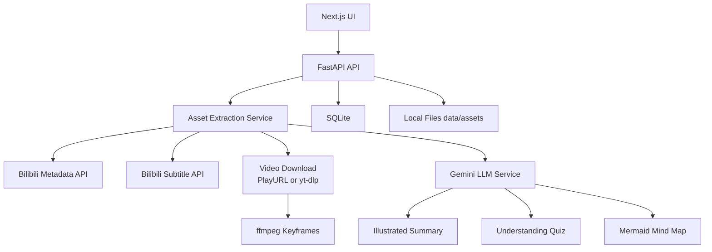

# Bili Knowledge Asset

Turn a public Bilibili video into a reusable local knowledge asset with metadata, optional transcript, visual evidence, structured notes, and generated study outputs.

## Project Overview

This project is designed as a local-first product prototype. The goal is not perfect extraction accuracy; the goal is a complete end-to-end loop:

1. Paste a public Bilibili URL.
2. Parse the BVID and fetch metadata from Bilibili.
3. Persist an asset in SQLite and local files.
4. Attempt transcript extraction.
5. Attempt video download and keyframe extraction with `ffmpeg`.
6. Attempt Gemini-powered frame descriptions and structured notes.
7. Generate reusable outputs from one or more stored assets.

The app preserves partial results. A failed subtitle, video, or Gemini step should not destroy the asset.

## What Problem It Solves

Bilibili videos are hard to reuse as structured knowledge. This project converts a single video into a persistent asset that can be:

- revisited later
- combined with other assets
- summarized with visual references
- turned into quizzes or other downstream formats

It is explicitly not transcript-only. The asset model includes visual content through keyframes and frame descriptions.

## Features

- FastAPI backend with SQLite persistence
- Next.js + TypeScript frontend
- Local asset bundles under `data/assets/{bvid}/`
- Metadata extraction from the required Bilibili API
- Subtitle extraction attempt through Bilibili player subtitle APIs
- Video download attempt through Bilibili play URL + `yt-dlp` fallback
- Keyframe extraction through `ffmpeg`
- Gemini integration behind a modular `backend/app/services/llm.py`
- Fallback generation when Gemini is unavailable
- Multi-asset output generation
- Generated outputs stored in SQLite and shown on asset detail pages

## Architecture



## Setup Instructions

### Prerequisites

- Python 3.11+ recommended
- Node 20+ recommended
- `ffmpeg` installed and available on `PATH` for keyframe extraction
- A Google Gemini API key from Google AI Studio

### Environment Variables

Copy `.env.example` values into your shell or local env file:

```bash
GOOGLE_API_KEY=
GEMINI_TEXT_MODEL=gemini-2.5-flash
GEMINI_VISION_MODEL=gemini-2.5-flash
FRONTEND_ORIGIN=http://localhost:3000
NEXT_PUBLIC_API_BASE_URL=http://localhost:8000
```

If Google returns a model error, change `GEMINI_TEXT_MODEL` and `GEMINI_VISION_MODEL` to another available Gemini model in your account/region.

## How To Run Backend

```bash
cd backend
python -m venv .venv
source .venv/bin/activate
pip install -r requirements.txt
uvicorn main:app --reload --port 8000
```

Health check:

```bash
curl http://localhost:8000/api/health
```

## How To Run Frontend

```bash
cd frontend
npm install
npm run dev
```

Open [http://localhost:3000](http://localhost:3000).

## How To Test With A Bilibili URL

1. Start backend and frontend.
2. Paste a public Bilibili URL into the home page.
3. Click `Create Asset`.
4. Open the asset detail page from the asset list.
5. Verify metadata appears immediately.
6. If subtitle extraction succeeds, transcript chunks will appear.
7. If video download plus `ffmpeg` succeed, keyframes will appear.
8. Use the Generate page or the asset detail page to create:
   - `Illustrated Summary`
   - `Understanding Quiz`
   - optional `Mermaid Mind Map`

## Backend Endpoints

- `POST /api/assets/create`
- `GET /api/assets`
- `GET /api/assets/{asset_id}`
- `POST /api/generate`
- `GET /api/health`

## Extraction Strategy

1. Parse BVID from URL using regex.
2. Fetch metadata from `https://api.bilibili.com/x/web-interface/view?bvid={bvid}`.
3. Save metadata to SQLite + `metadata.json`.
4. Attempt subtitles via Bilibili player subtitle APIs.
5. Attempt playable video URL via Bilibili play URL API.
6. If that fails, try `yt-dlp`.
7. If a video file exists, extract up to 12 frames at 60-second intervals with `ffmpeg`.
8. Attempt Gemini frame descriptions.
9. Attempt Gemini structured notes.
10. Store everything that succeeded and mark the asset `ready` or `partial_ready`.

## Memory / Storage Structure

```text
data/
  app.db
  assets/
    {bvid}/
      metadata.json
      video.mp4 or video.<ext>
      audio.wav optional
      frames/
        frame_001.jpg
        frame_002.jpg
      transcript.json
      visual_descriptions.json
      structured_notes.json
```

SQLite tables:

- `assets`
- `transcript_chunks`
- `keyframes`
- `generated_outputs`

## Output Abstraction

The generation layer is intentionally model-agnostic. `backend/app/services/llm.py` exposes:

- `generate_text(prompt: str) -> str`
- `describe_image(image_path: str, context: str) -> str`
- `generate_structured_notes(asset_data) -> str`
- `generate_output(asset_data_list, output_type, user_prompt) -> str`

Current output types:

- `illustrated_summary`
- `understanding_quiz`
- `mermaid_mind_map`

The API and UI treat outputs as typed generated artifacts, not as one-off prompts.

## Failure Handling

- Metadata failure: asset creation fails because metadata is the minimum viable input.
- Subtitle failure: asset still persists; transcript is marked unavailable.
- Video download failure: asset still persists as metadata-first.
- `ffmpeg` missing/failing: asset still persists without keyframes.
- Gemini missing/failing: fallback notes/descriptions/output are used and the asset is marked `partial_ready`.
- Multi-asset generation works even if some assets are metadata-only.

## Core Tradeoffs

- Synchronous extraction in `POST /api/assets/create` keeps the implementation simple for a local demo.
- ChromaDB was intentionally skipped in favor of a lightweight keyword retrieval fallback to reduce setup friction.
- Subtitle extraction is API-first, not ASR-based, because fast local transcription would expand scope.
- The UI avoids heavy markdown/rendering dependencies and instead shows plain formatted text blocks for speed.

## What Was Intentionally Cut

- Background jobs and job queue
- Asset retry endpoint
- User auth
- Full-text or vector indexing service
- OCR pipeline for frames
- Automatic audio transcription fallback
- Rich markdown rendering and export
- Batch imports

## If Given One More Week, What I Would Improve

- Add async/background extraction jobs with live polling
- Add retry controls per failed extraction stage
- Add Whisper-style local transcription fallback
- Add OCR on frames and tighter visual grounding
- Add ChromaDB or SQLite FTS retrieval
- Add prompt/version tracking for generated outputs
- Add export formats like Markdown, PDF, and Anki-ready cards
- Improve Bilibili media acquisition robustness across more video types

## Project Structure

```text
backend/
  app/
    routers/
    services/
    config.py
    db.py
    models.py
    schemas.py
  main.py
  requirements.txt
frontend/
  app/
  components/
  lib/
data/
BUILD_LOG.md
README.md
```
