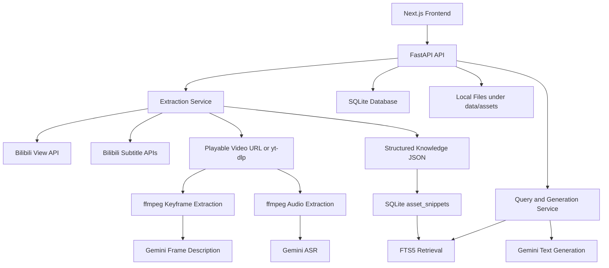

# Bili Knowledge Asset

Turn a public Bilibili video into a reusable local knowledge asset with transcript evidence, visual keyframes, structured notes, searchable memory, and generation tools.

## Problem

Watching a useful Bilibili video does not automatically produce something reusable. The source video may contain facts, arguments, procedures, visuals, and examples, but after the watch session those signals are hard to search, compare, and repurpose.

Bili Knowledge Asset converts that video into a local-first study asset:

- source metadata
- transcript chunks
- keyframes and visual descriptions
- structured knowledge JSON
- indexed memory for retrieval
- generated outputs like summaries, quizzes, and mind maps

## Core User Flow

`Bilibili URL -> extraction -> knowledge asset -> memory -> query / generate`

1. Paste a public Bilibili URL.
2. Extract metadata from Bilibili.
3. Attempt subtitles, then Gemini ASR fallback if subtitles are missing.
4. Attempt video download, extract keyframes, and describe frames.
5. Generate structured knowledge JSON.
6. Index snippets into SQLite FTS memory.
7. Reuse the stored asset for Q&A, illustrated summaries, quizzes, Mermaid mind maps, and multi-asset comparison.

## Features

- Bilibili metadata ingestion
- subtitle extraction with Gemini ASR fallback
- keyframe extraction with `ffmpeg`
- visual descriptions for sampled frames
- structured knowledge JSON
- SQLite FTS5 memory / retrieval
- single-asset querying
- multi-asset querying
- multi-output generation
- retryable extraction stages
- graceful `partial_ready` behavior instead of hard failure

## Architecture



## Tech Stack

- Backend: Python, FastAPI, SQLAlchemy
- Frontend: Next.js, TypeScript
- Storage: SQLite + local filesystem
- Retrieval: SQLite FTS5
- Video processing: `ffmpeg`
- AI: Google Gemini via `google-genai`

## Project Structure

```text
backend/
frontend/
data/
  app.db
  assets/
    {bvid}/
      metadata.json
      video.mp4 or video.<ext>
      audio.wav
      frames/
      transcript.json
      visual_descriptions.json
      structured_notes.json
```

## Local Setup

### Prerequisites

- Python 3.11+
- Node 20+
- `ffmpeg` available on `PATH`
- Google Gemini API key

### Environment Variables

Copy [`.env.example`](/Users/hanmingx/Documents/Bili%20Knowledge%20Asset/.env.example) to `.env` and fill in placeholders:

```bash
GOOGLE_API_KEY=
GEMINI_TEXT_MODEL=gemini-2.5-flash
GEMINI_VISION_MODEL=gemini-2.5-flash
FRONTEND_ORIGIN=http://localhost:3000
NEXT_PUBLIC_API_BASE_URL=http://localhost:8000
```

No real secrets should be committed.

## Run Instructions

### Backend

```bash
cd backend
python -m venv .venv
source .venv/bin/activate
pip install -r requirements.txt
uvicorn main:app --reload --port 8000
```

### Frontend

```bash
cd frontend
npm install
npm run dev
```

Open [http://localhost:3000](http://localhost:3000).

## API Surface

- `POST /api/assets/create`
- `GET /api/assets`
- `GET /api/assets/{asset_id}`
- `POST /api/assets/{asset_id}/query`
- `POST /api/query`
- `POST /api/assets/{asset_id}/retry`
- `POST /api/generate`
- `GET /api/health`

## Extraction Strategy

1. Parse BVID from the submitted URL.
2. Fetch metadata from Bilibili.
3. Persist the asset and local directory.
4. Attempt transcript extraction from subtitles.
5. If subtitles are missing, extract audio with `ffmpeg` and transcribe using Gemini ASR.
6. Attempt video download with Bilibili stream resolution first, then `yt-dlp` fallback.
7. Validate downloaded media before accepting it.
8. Extract one frame every 60 seconds, capped at 12 frames.
9. Generate concise visual descriptions for keyframes.
10. Build structured knowledge JSON.
11. Index memory snippets into SQLite FTS5.

## Memory Design

The retrieval layer uses SQLite only.

### Snippet Sources

`asset_snippets` is populated from:

- transcript chunks
- visual descriptions
- structured summary
- facts, arguments, concepts, timeline items, and visual evidence
- metadata summary text

### Retrieval Flow

1. Search SQLite FTS5 first.
2. Fall back to local token-overlap ranking if needed.
3. Pass evidence snippets into:
   - asset Q&A
   - multi-asset Q&A
   - illustrated summary generation
   - understanding quiz generation
   - Mermaid mind map generation

## Output Generation

Supported output modes:

- Illustrated Summary
- Understanding Quiz
- Mermaid Mind Map

Outputs are grounded in stored evidence instead of raw source text alone.

## Failure Handling

- Missing subtitles: Gemini ASR fallback is attempted.
- Failed video download: the asset still persists as metadata-first and may still generate outputs.
- Gemini failure: fallback structured knowledge or limited visual descriptions are stored when possible.
- Partial extraction: the asset is marked `partial_ready` rather than becoming unusable.
- Retry stages:
  - `transcript`
  - `keyframes`
  - `vision`
  - `notes`
  - `all`

## Demo Flow

1. Paste a public Bilibili URL on the home page.
2. Create the asset.
3. Open the asset detail page.
4. Review metadata, structured knowledge, transcript, and keyframes.
5. Ask a question in `Ask This Asset`.
6. Generate an Illustrated Summary.
7. Generate an Understanding Quiz.
8. Generate a Mermaid Mind Map.
9. Open `/generate` and run a cross-asset query or multi-asset output.
10. Retry a failed extraction stage if needed.

More detail is in [DEMO.md](/Users/hanmingx/Documents/Bili%20Knowledge%20Asset/DEMO.md).

## Core Tradeoffs

- SQLite FTS instead of a vector database:
  simpler setup, easier local evaluation, lower operational risk
- local files instead of cloud object storage:
  faster to inspect, easier to demo in a 48-hour scope
- sampled keyframes instead of full scene understanding:
  enough to satisfy visual evidence requirements without heavy video analysis
- synchronous extraction instead of background jobs:
  simpler end-to-end flow for a local assignment demo

## What Was Cut

- OCR over frames
- scene detection
- vector embeddings store
- background worker queue
- auth and user accounts
- cloud deployment and object storage

## If Given One More Week

- stronger Bilibili download robustness
- better ASR chunking and timestamp alignment
- OCR on keyframes
- richer citations in generated outputs
- background jobs and progress tracking
- export formats like Markdown, PDF, or flashcards

## Screenshots

Screenshot placeholders:

- Home page
- Asset detail page
- Generator page

If screenshots are not bundled, the live local UI covers the evaluator flow cleanly.
